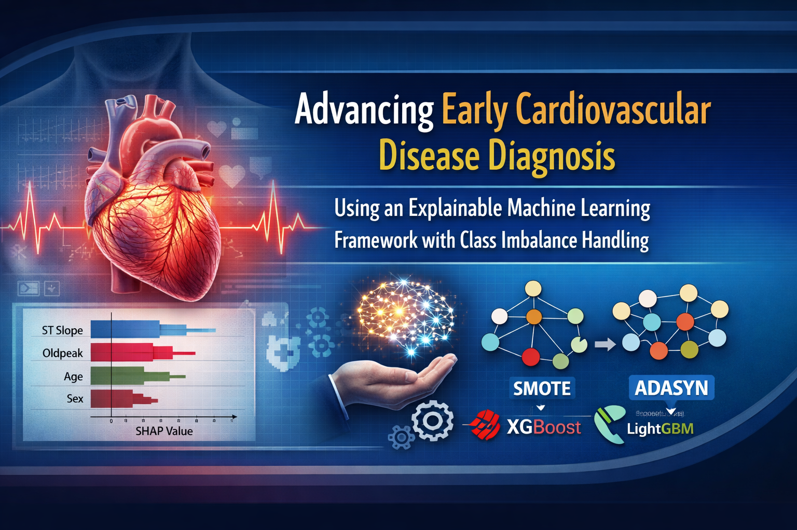

# Advancing Early Cardiovascular Disease Diagnosis Using an Explainable Machine Learning Framework with Class Imbalance Handling

  

## Abstract
Bridging the gap between latent cardiovascular risk and actionable clinical decision-making remains one of the most critical challenges in modern healthcare. Despite significant advances in clinical cardiology, cardiovascular disease often remains undetected during its most critical early stages. This diagnostic gap limits timely preventive intervention and continues to drive avoidable mortality worldwide. To address this challenge, this paper proposes a reliable machine learning framework for early cardiovascular disease (CVD) diagnosis by integrating clinical data with self-reported non-clinical features. Initially, this study investigated several data-balancing techniques, including SMOTE, SMOTETomek, ADASYN, Tomek Links, and SMOTE-ENN along with various encoding strategies within the data-preprocessing pipeline. Multiple machine learning models, namely Random Forest, XGBoost, LightGBM, SVM, and an MLP classifier were explored with rigorous hyperparameter optimization and validated on a widely adopted multi-regional UCI heart disease dataset. Experimental results showed that, with the integration of class-balancing techniques, XGBoost and LightGBM individually achieved a benchmark accuracy of 92.93\%. Moreover, a weighted ensemble of them further enhanced the accuracy to 93.47\%. To strengthen ethical considerations and clinical trustworthiness, model explainability was incorporated using SHAP and LIME to identify the most influential features contributing to prediction outcomes. The analysis revealed that, among clinical attributes, ECG-related features, including ST-segment slope (exercise-induced ST change) (+0.14) and Oldpeak (ST depression magnitude) (+0.06) emerged as dominant predictors of CVD risk. In contrast, several non-clinical features, including age and sex, also demonstrated notable influence on CVD prediction. By transforming heterogeneous clinical and non-clinical data into interpretable early-risk indicators, the proposed framework supports proactive cardiovascular screening and informed clinical decision-making.

## Dataset Source
https://www.kaggle.com/datasets/fedesoriano/heart-failure-prediction