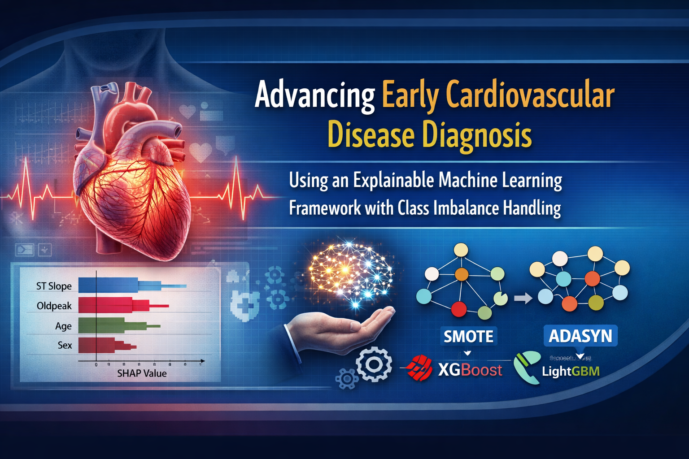

# An Adaptive AIW-GTO Optimization for Interpretable Machine Learning in Early Cardiovascular Disease Detection

  

## Abstract
Transforming latent cardiovascular risk into actionable clinical decisions remains a major challenge in contemporary healthcare. Despite advances in cardiology, early-stage cardiovascular disease often remains undetected, which hinders timely intervention and leads to preventable deaths.  To overcome this problem, this study presents an explainable machine learning framework for the early diagnosis of cardiovascular disease (CVD). Initially, this study examined several data-balancing strategies, for example, SMOTE, SMOTETomek, Tomek Links, ADASYN and SMOTE-ENN within the data-preprocessing pipeline. We proposed a novel Adaptive Inertia Weight Gorilla Troops Optimizer (AIW-GTO) to overcome classical GTO’s unstable convergence by adaptively controlling step sizes. It uses large exploratory steps early for wide search and smaller steps later for fine-tuned local optimization which ensures stable convergence and enhanced optimization accuracy. Several machine learning techniques, namely XGBoost, Random Forest, SVM, LightGBM and MLP classifier were evaluated on multi-regional UCI heart disease dataset. The experimental findings revealed that, by integrating AIW-GTO Optimization and class imbalance mitigation, LightGBM and XGBoost individually achieved a benchmark accuracy of 93.48% and 91.85% respectively. Moreover, a weighted ensemble of them further improved the accuracy to 94.02%. Sensitivity analysis further evaluated the model’s ability to perform under incomplete clinical test data. To enhance ethical considerations and clinical trust, SHAP and LIME were utilized to provide model explainability and identify the most influential features affecting prediction outcomes. Analysis indicated that, ECG-related features, including ST_Slope (exercise-induced ST change) (+0.14) and Oldpeak (ST depression magnitude) (+0.06) emerged as key predictors of CVD risk. Overall, the proposed framework provides a clinically reliable and interpretable approach for early cardiovascular risk assessment to enable proactive patient management.

## Dataset Source
https://www.kaggle.com/datasets/fedesoriano/heart-failure-prediction
